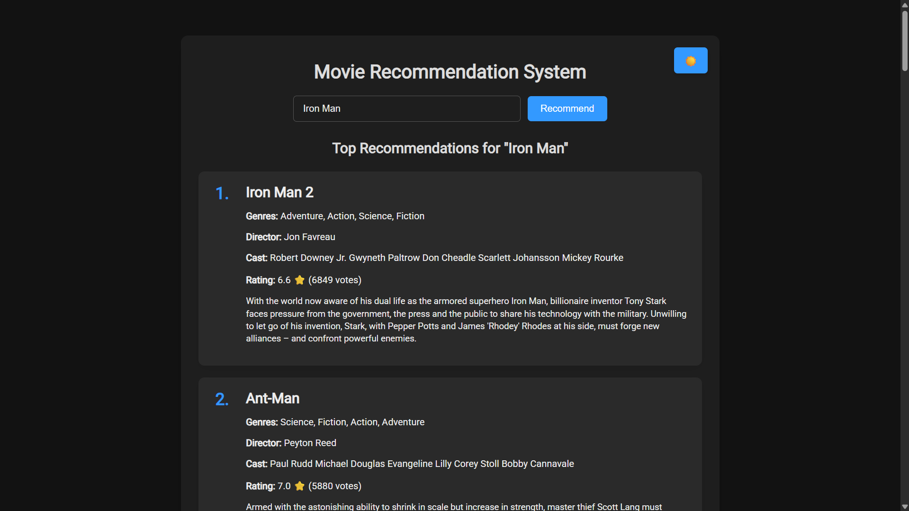
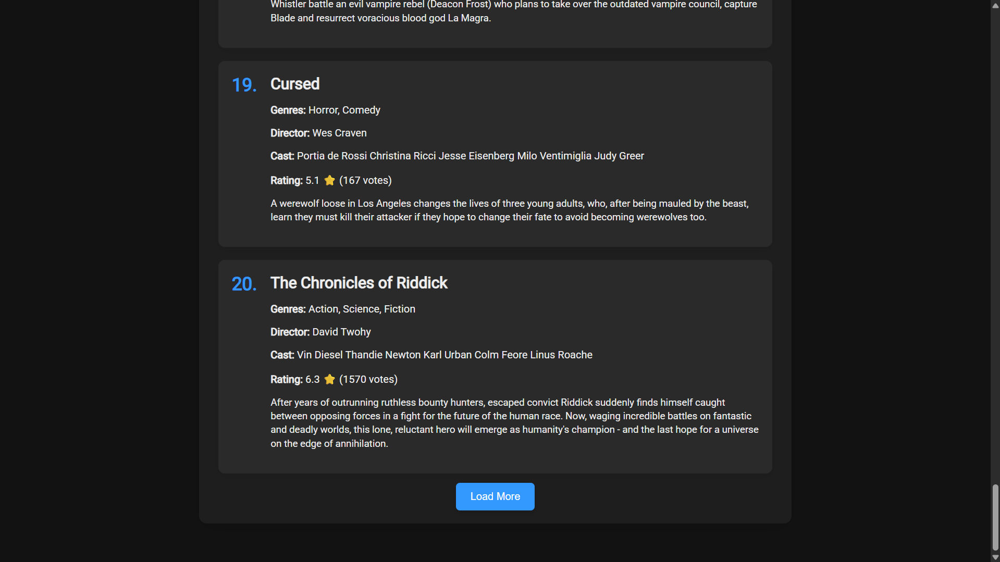

# Movie Recommendation System (Flask + TF-IDF)

A content-based movie recommendation web application built with **Flask**, **scikit-learn**, and **TF-IDF Vectorization**.  
The app suggests similar movies based on genres, keywords, cast, crew, and more, using cosine similarity.

## Screenshots

## Features
- Content-based filtering using TF-IDF and cosine similarity
- Search by movie title for recommendations
- "Load More" button loads more results
- Dark/Light mode toggle
- Responsive design with custom CSS

## Tech Stack
- **Backend:** Flask, Python
- **ML/NLP:** scikit-learn, pandas, numpy
- **Frontend:** HTML, CSS, JavaScript
- **Data Storage:** Pickle (`joblib`) for precomputed similarity matrix (generated locally)
